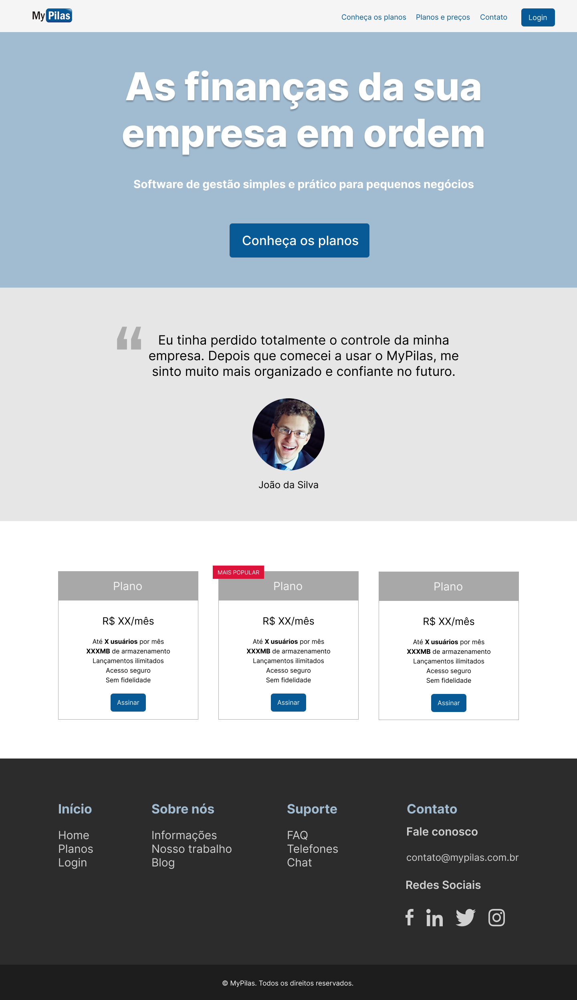
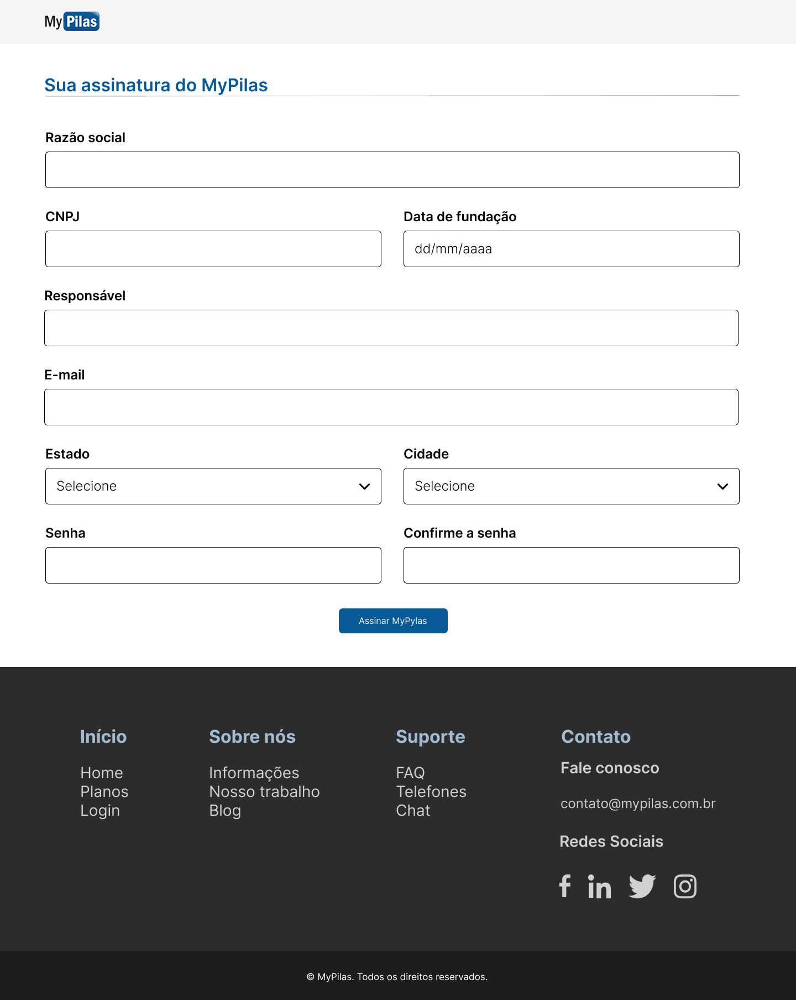

# Projeto-AlgaWorks

Neste projeto será desenvolvido um site para uma empresa
fictícia MyPilas utilizando como base as aulas do curso da
AlgaWorks. O design do projeto será responsivo.

A seguir o protótipo do site para Desktop:

1. Página inicial:

2. Login:

3. Assinar:

Link do protótipo no Figma:

